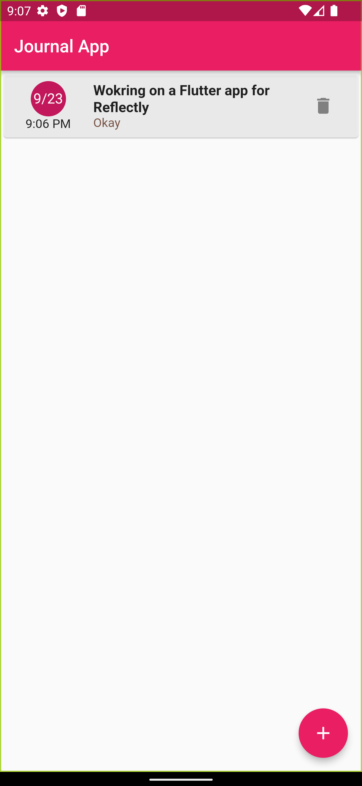
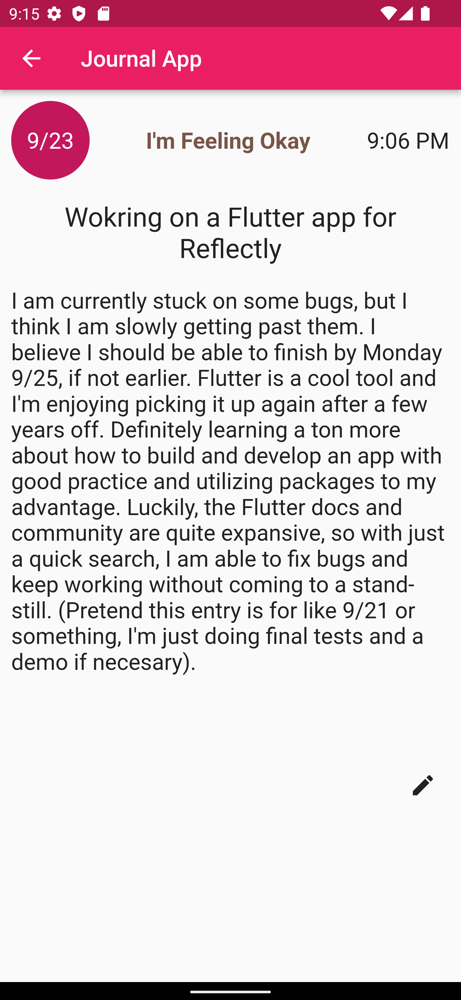
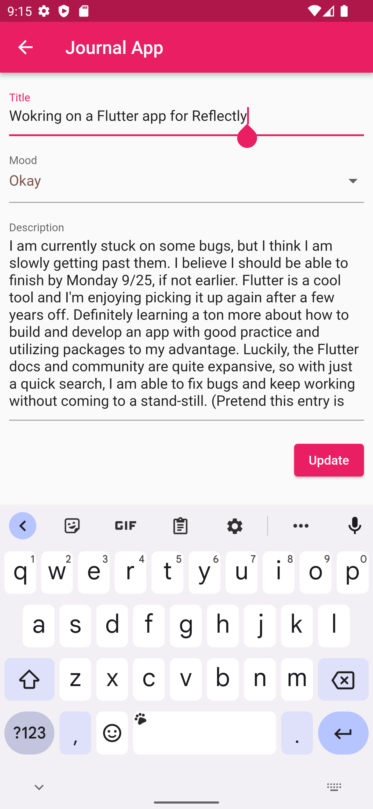
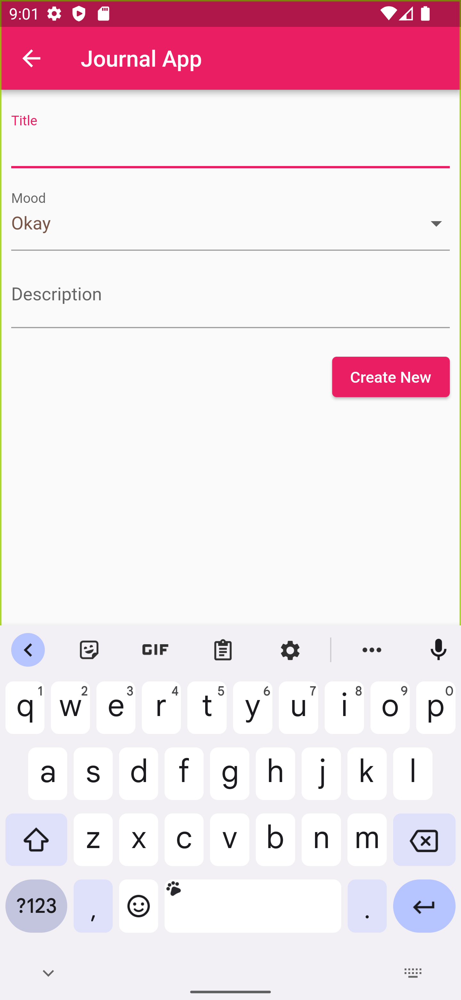
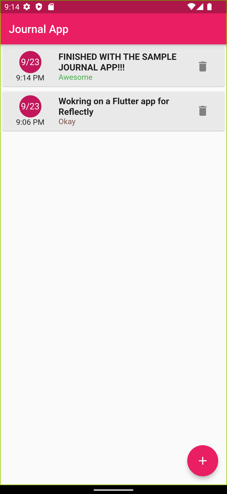

# Journal App

Sample Journal Flutter App for Reflectly

## Screenshots and Demo Gifs

  I developed, debugged, and tested my code for Android because I do not have a mac, xcode, or an official method of emulating for iPhones. I used an emulated Google Pixel 7 Pro with an up-to-date software (12L) and an API level of 32. 

 

Below are some screenshots and gifs of the app flow (it's pretty simple, but I'm adding the pictures for convenience). Gifs may be choppy.
|*List View of Journals*|*Full Journal Page*|*Edit Page*|
|:--:|:--:|:--:|
|  |  |  |

|*Create a Journal*|*Updated List View*|*Editing the New Journal*|*Deleting a Journal*|
|:--:|:--:|:--:|:--:|
|  |  |  |  |
